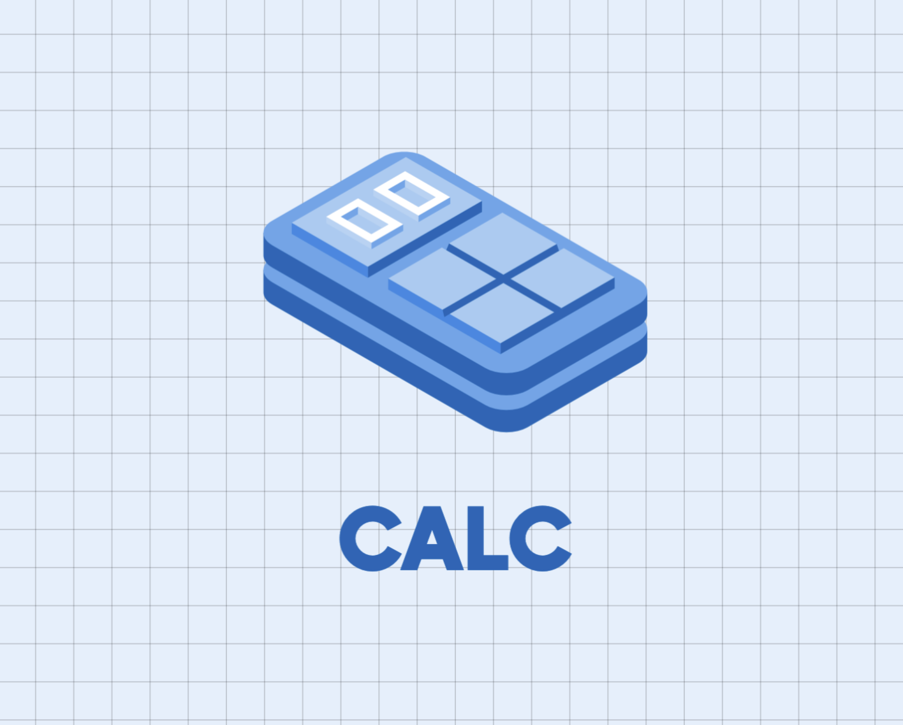

# CALC



#### A simple web-calculator for mobile devices, fully-responsive with proper functionalities and eye-catching digit color seperation.
#### This application supports manifest.json file for easy installation on mobile through google chrome

## BADGES


[](https://choosealicense.com/licenses/mit/)

[](https://opensource.org/licenses/)

[](http://www.gnu.org/licenses/agpl-3.0)


## FEATURES

- Simple, ease and fun to play
- Easy building
- One click installation in mobile through google chrome


## RUN THE PROJECT LOCALLY

Clone the project

```bash
  git clone https://link-to-project
```

Go to the project directory

```bash
  cd calculator-application
```

Installing dependencies

```bash
  npm install
```

Start the application

```bash
  npm run compile-scss
```

[@SUVAJIT-KARMAKAR](https://github.com/SUVAJIT-KARMAKAR)